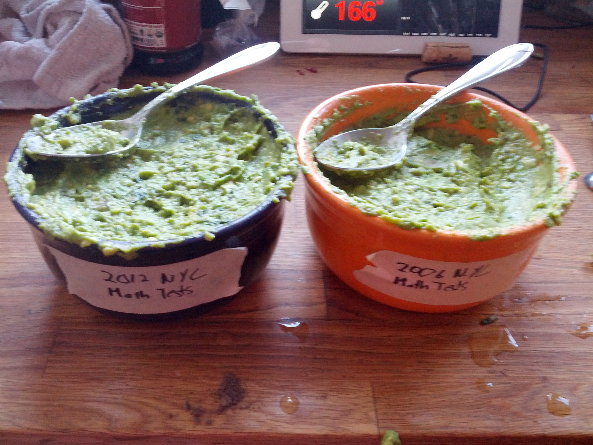

http://hackforchange.org/submit
=======

## Title
Gastronomification and other multi-sensory data experiences

## Project/Story Type
Other Project

## Primary Contact Name
Thomas Levine

## Primary Contact Email
wildebeest@thomaslevine.com

## Short Overview

## What National Day of Civic Hacking event did you attend?

## Additional Team Members & Contact Info
Brian Abelson
Jake Bialer
Burton DeWilde
Michael Keller
Cezary Podkul

## What Challenge Did You Address?
OTHER - Define Below

## If the challenge you addressed is not on the list above, please describe it here.
Governments have recently made great strides towards opening raw datasets online,
but much still needs to be done to make them accessible and comprehensible.

## Video Link
???

## Photos/Screenshots

## Website
http://csvsoundsystem.com

## Source Code
https://github.com/tlevine/gastronomify

## Project/Story Description
Traditionally, people have produced visualizations in order to make sense of data,
but we feel that we are reaching the limits of this approach. Open data efforts have
led to the release diverse, rich and varied open datasets. Human vision simply does
not have enough bandwidth to consume such complex data, so we experimented with the
use of other senses to experience data.

At the Bicoastal Datafest, we produced the FMS Symphony, a music video about the
relationships between federal spending, the federal interest rate, the debt ceiling
and the financial crisis over the past few years. A couple months later, we released
an R library for data sonification called "ddr".

We've continued to explore the potential of non-visual senses, and we think that
music videos are just the beginning. Music videos convey only two senses. In order
to increase our data bandwidth, we need to use all five senses, and we think that
that is best accomplished through food.

For the National Day of Civic Hacking, we made an R library called "gastronomify"
that allows data to be converted into food. It modifies a base recipe based on the
data passed to it, and then it automatically hires someone to prepare the recipe
with TaskRabbit. We used the library to prepare a gastronomification of New York
City [math test scores](https://data.cityofnewyork.us/Education/Math-Test-Results-2006-2012-District-All-Students/7yig-nj52).

## How Will This Project Have Impact?
Gastronomification facilitates an ambient, passive approache data analysis, allowing
people to experience richer datasets without specialized knowledge.

## What Happens Next?
We are continuing our research into data gastronomification, and we are preparing
more music videos for a CSV Soundsystem US tour.

Our current data gastronomification implementation is quite naive; we are working
with a chef to explore different paradigms of expressing data in food. We aim for
an approach that allows us to independently vary the texture, taste, visual
appearance and smell of food, allowing us to employ all five senses for conveying data.

We have been lining up performance venues and preparing a full set of music videos.
We recently produced the Ridership Rachenitsa, a music video about transit ridership
over the past few years in Chicago and New York. We are currently working on the
a data-driven music video about the BitCoin economy, a data-driven music video
about the daily activities of New Yorkers.

We eventually plan on making the processes of data sonification and
gastronomification more accessible to laypeople, but we feel that we first need to
explore different approaches to multi-sensory data experiences.

## Who Does This Project or Story Affect?
The gastronomify library makes it easy for a data scientist to prepare a data
gastronomification that can be understood by non-data-scientists. We intend that
gastronomification will benefit everyone, but we see particular groups that it will
help most.

*People who are blind*: Data visualizations are less helpful for people who cannot
see. We currently lack a strategy for conveying complex information to people who
are blind. Representing data with other senses can provide such a strategy.

*Young people*: Data is trendy these days. Data scientists are
[sexy](http://hbr.org/2012/10/data-scientist-the-sexiest-job-of-the-21st-century/),
Nate Silver is common dinnertable conversation. The White House used data to appeal
to young people. http://www.youtube.com/watch?v=JwuEnyV1Cb0

*People who monitor daily data feeds*: The gastronomify library can be used
immediately to assist in the monitoring of daily data feeds. A data-driven meal can
be produced every day to represent the status of a system. This can help investment
bankers in monitoring the stock market, computer system administrators in monitoring
servers and journalists in monitoring diverse content feeds.

## How Might This Project or Story Create Value for Individuals?
Data gastronomification and data music videos are part of the larger theme of
conveying complex quantitative information to the general public in order to engage
them in important issues. In order to make the best use of open data, we need to
make it comprehensible to everyone.

## How Does This Project or Story Show the Value of Collaboration Between Communities and/or Corporations, and/or Governments?
We are a team of data scientists and data journalists. Together, we are able to
discover important datasets, conduct advanced analyses and frame them in a way that
the public can understand.

## Additional Resources
http://www.dnainfo.com/new-york/20130429/greenpoint/data-driven-band-csv-soundsystem-makes-music-from-spreadsheets
http://livestream.com/knerd/video?clipId=pla_a5d59285-9399-47dc-aaef-2b9a77142d5e
https://github.com/csv/ddr
http://csvsoundsystem.com
http://fms.csvsoundsystem.com
http://www.youtube.com/watch?v=tcnoBL0tvpc

## Additional Files (please place all additional files in a single zip file)
No additional files

## Yes, please consider this project for the "Art of Civic Hacking" exhibit coming in Fall 2013.
Yes
